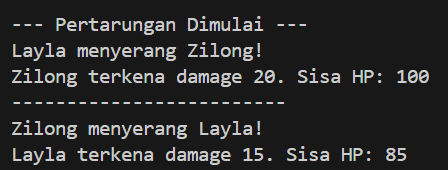
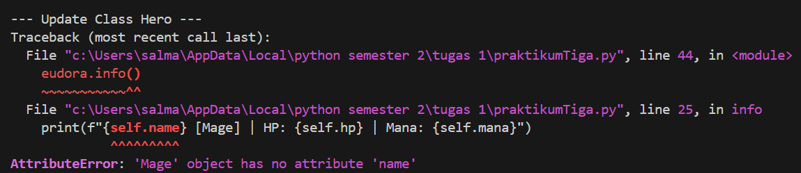
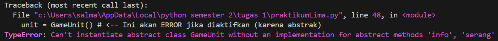
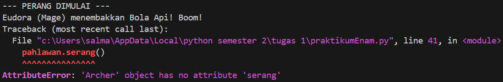
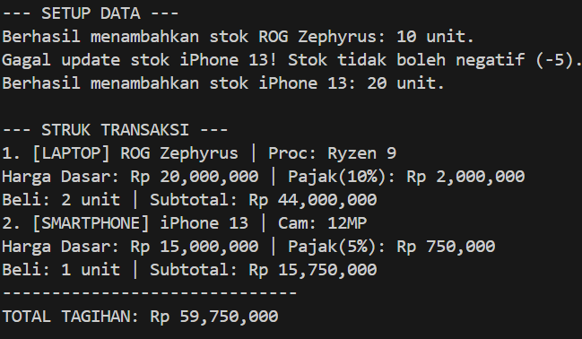

# 🚀 Laporan Praktikum Object-Oriented Programming (OOP) - Python

Repository ini berisi dokumentasi tugas analisis dan proyek praktikum untuk mata pelajaran pemrograman berorientasi objek.

---

## 📝 Tugas Analisis 1
**Pertanyaan:**
Apa yang terjadi jika kamu mengubah `hero1.hp` menjadi 500 setelah baris `hero1 = Hero(...)`? Coba lakukan `print(hero1.hp)`.

**Jawaban:**
Perubahan nilai tersebut akan berhasil dan nilai HP `hero1` menjadi 500. Saat dijalankan `print(hero1.hp)`, output akan menampilkan angka 500. Hal ini membuktikan bahwa atribut yang didefinisikan secara publik dapat dimodifikasi secara bebas dari luar class tanpa melalui metode validasi.

**Output Program:**

---

## 📝 Tugas Analisis 2
**Pertanyaan:**
Perhatikan parameter `lawan` pada method `serang`. Parameter tersebut menerima sebuah objek utuh, bukan hanya string nama. Mengapa ini penting?

**Jawaban:**
Sangat penting karena dengan menerima objek utuh, method `serang` memiliki akses penuh terhadap atribut dan method milik objek tersebut. Hal ini memungkinkan objek penyerang untuk memanipulasi status objek lawan secara langsung (seperti memanggil method `lawan.diserang()`), yang tidak bisa dilakukan jika hanya mengirimkan string nama.

**Output Program:**

---

## 📝 Tugas Analisis 3
**Pertanyaan:**
1. Apa error yang muncul saat menghapus `super().__init__(name, hp, attack_power)`?
2. Mengapa error tersebut mengatakan `Mage object has no attribute 'name'`, padahal kita mengirim nama "Eudora" saat pembuatan objek?
3. Jelaskan peran fungsi `super()` dalam menghubungkan data dari class Anak ke class Induk!

**Jawaban:**
1. **Error:** `AttributeError: 'Mage' object has no attribute 'name'`.
2. **Penyebab:** Meskipun argumen "Eudora" dikirim, tanpa `super()`, constructor milik kelas induk (`Hero`) tidak dijalankan. Akibatnya, proses inisialisasi atribut `name`, `hp`, dan `attack_power` tidak pernah terjadi untuk objek tersebut.
3. **Peran `super()`:** Sebagai penghubung untuk memanggil metode atau atribut dari class induk. Dalam hal ini, memastikan class anak mewarisi seluruh proses inisialisasi dasar yang sudah didefinisikan di class induk.

**Output Program:**

---

## 📝 Tugas Analisis 4
**Pertanyaan:**
1. Apakah nilai HP muncul saat diakses lewat `print(hero1._Hero__hp)`? Mengapa Python tetap mengizinkan akses ini padahal sudah dibuat private?
2. Apa yang terjadi jika logika `if/elif` di Setter dihapus, lalu kita mengisi nilai -100 pada HP? Mengapa Setter sangat penting untuk integritas data?

**Jawaban:**
1. **Muncul.** Python menggunakan mekanisme *Name Mangling* yang secara teknis hanya menyamarkan nama atribut private, bukan menguncinya total. Tujuannya adalah mencegah kecelakaan akses, namun secara konvensi tetap tidak boleh diakses langsung.
2. **Hasil Uji:** Jika validasi dihapus, HP akan bernilai -100 (data tidak valid). **Pentingnya Setter:** Untuk melakukan validasi data sebelum disimpan, memastikan nilai atribut tetap berada dalam batas yang logis (misalnya tidak boleh negatif).

**Output Program:**

---

## 📝 Tugas Analisis 5
**Pertanyaan:**
1. Hapus method `serang` di class `Hero` (tapi tetap ada di `Monster`). Apa error yang muncul? Apa konsekuensi jika kita lupa membuat method yang sudah "dijanjikan" di interface?
2. Mengapa class `GameUnit()` dilarang untuk dibuat menjadi objek (`unit = GameUnit()`)? Apa gunanya sebuah class jika tidak bisa dibuat objeknya?

**Jawaban:**
1. **Error:** `TypeError: Can't instantiate abstract class Hero with abstract method serang`. Konsekuensinya, class tersebut tidak bisa digunakan (diinstansiasi) sampai semua method abstrak yang dijanjikan telah diimplementasikan.
2. **Alasan:** `GameUnit` adalah Abstract Class yang hanya berfungsi sebagai cetak biru atau standar. Gunanya adalah untuk memastikan semua class turunan memiliki struktur (method) yang seragam tanpa harus memberikan detail implementasi di level induk.

**Output Program:**

---

## 📝 Tugas Analisis 6
**Pertanyaan:**
1. Tambahkan class `Healer`. Apakah program tetap berjalan lancar? Apa keuntungan Polymorphism bagi programmer di masa depan jika ingin menambah banyak karakter baru?
2. Apa yang terjadi jika nama method di class `Archer` diubah menjadi `tembak_panah`? Mengapa dalam Polymorphism nama method harus persis sama?

**Jawaban:**
1. **Lancar.** Keuntungan Polymorphism adalah skalabilitas; kita bisa menambah banyak karakter baru tanpa perlu mengubah kode pada bagian loop atau logika utama, selama karakter tersebut mengikuti struktur yang sama.
2. **Hasil:** Program akan error (`AttributeError`) karena loop mencoba memanggil `.serang()` yang tidak ada pada `Archer`. Nama harus sama agar satu instruksi seragam dapat dipahami oleh berbagai macam objek yang berbeda.

**Output Program:**

---

## 🏗️ Proyek Praktikum: TechMaster Inventory System

Proyek ini mengintegrasikan seluruh konsep OOP:
* **Abstraction:** Menggunakan class `BarangElektronik` sebagai template abstrak.
* **Encapsulation:** Melindungi data `stok` dan `harga` dengan atribut private dan validasi pada Setter.
* **Inheritance:** Class `Laptop` dan `Smartphone` mewarisi properti dasar dari `BarangElektronik`.
* **Polymorphism:** Method `hitung_harga_total()` memberikan hasil berbeda (berdasarkan pajak produk) meski dipanggil dengan cara yang sama.

**Output Program:**

